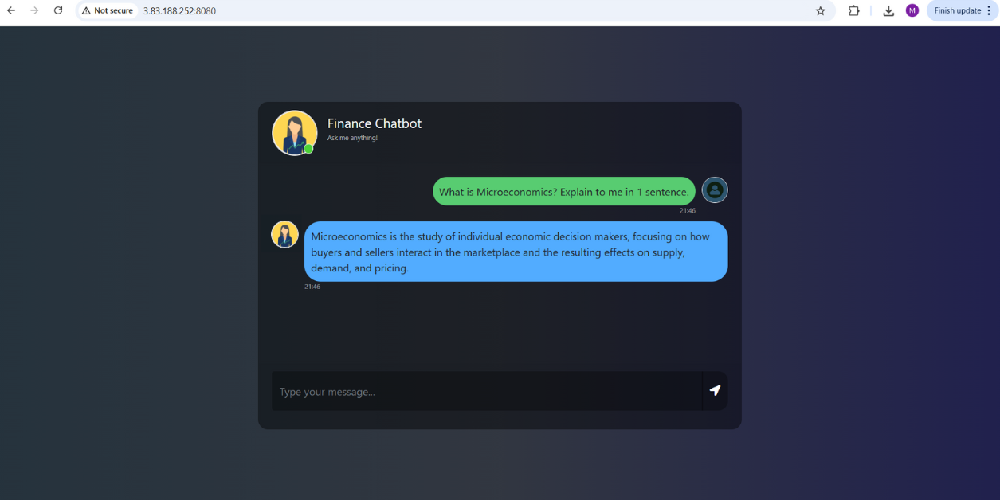

# Finance Chatbot with LLMs, LangChain, Pinecone, Flask & AWS

This project is a **Finance Chatbot** powered by Large Language Models (LLMs). It was built using **LangChain, Pinecone, and Flask**, then **containerized with Docker** and deployed on **AWS** using IAM, ECR, and EC2.


## Features

* **Interactive Chat** – Ask finance-related questions and get answers.
* **Finance Knowledge Base** – Trained on financial data and documents.
* **LangChain Integration** – Manages prompts, retrieval, and response flow.
* **Vector Search with Pinecone** – Stores and retrieves financial embeddings for accurate answers.
* **Flask Web App** – Simple and responsive chat interface.
* **AWS Deployment** – Dockerized and deployed using **IAM, ECR, and EC2**.


##  How to Run Locally

Clone the repository:

```bash
git clone https://github.com/your-username/Finance-Chatbot.git
```

### 1. Create a conda environment

```bash
conda create -n financebot python=3.10 -y
conda activate financebot
```

### 2. Install requirements

```bash
pip install -r requirements.txt
```

### 3. Create a `.env` file in the root directory

```ini
PINECONE_API_KEY = "xxxxxxxxxxxxxxxxxxxxxxxxxxxxx"
OPENAI_API_KEY   = "xxxxxxxxxxxxxxxxxxxxxxxxxxxxx"
```

### 4. Store embeddings in Pinecone

```bash
python store_index.py
```

### 5. Run the app

```bash
python app.py
```

Then open in your browser:

```bash
http://localhost:8080
```


## Tech Stack

* **Python**
* **LangChain**
* **Flask**
* **GPT**
* **Pinecone**
* **Docker**
* **AWS (IAM, ECR, EC2)**


## AWS Deployment

The chatbot was deployed to AWS using the following flow:

1. **IAM** – Configured secure roles and permissions.
2. **ECR (Elastic Container Registry)** – Stored the Docker image.
3. **EC2 (Ubuntu)** – Pulled the image and ran the container.

### Deployment Steps

* Build Docker image of the source code
* Push image to **ECR**
* Launch an **EC2 instance**
* Pull image from **ECR** inside EC2
* Run the Docker container on EC2


## Deployment Screenshot

Since the EC2 instance has been stopped (to avoid ongoing AWS costs), here’s a screenshot of the chatbot **successfully deployed and running on AWS**:



